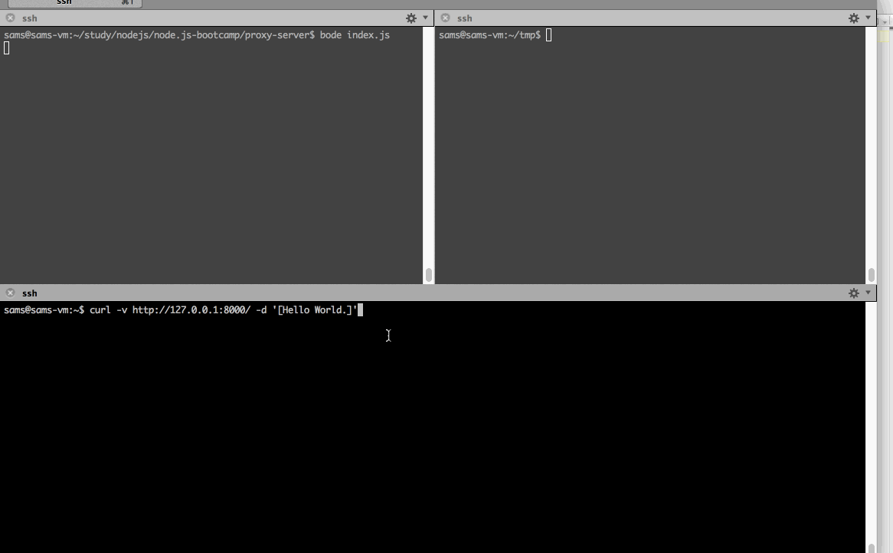

This is 00 project for Node.Js bootcamp

The project has below features:
 
  Echo Server
 
  Proxy server
 
  CLI Support

  Logging

Echo Server
 
  it is listening on port 8000 and can echo back both data and headers received.

Proxy Server

  it is listening on port 8001 and can proxy between request client and destination server.

  support both proxy to default destination url or the one specified header[x-destination-url] in the incoming request.

CLI
  
  it support below arguments
  
  --host specify host used in the default destination url for proxy server, default 127.0.0.1
 
  --port specify port used in the default destination url for proxy server, default 8000
 
  --url  in a convenient way to specify the default destination url for proxy server
 
  --logfile the logging info will get saved in the file specified.

Logging
  by default will display log info to stdout
  or save it properly to the file when the --logfile argument is given

Test Scenario 1:

1.  Start servers with default settings, log will shown in stdout and proxy server will proxy the requests to the echo server
    $bode index.js

2.  Verify the echo server
    $curl -v http://127.0.0.1:8000/ -d '[Hello World.]'

3.  Verify the proxy server with default destination url[echo server]
    $curl -v http://127.0.0.1:8001/ -d '[Hello World.]'

4.  Verify the proxy server with specified destination url in the client headers, access google
    $curl -v http://127.0.0.1:8001 -H 'x-destination-url:http://www.google.com'

Test Scenario 2:

1.  Start servers with CLI settings, log will save in the file specified and proxy server will proxy the requests to the url specified
    $bode index.js --url http://www.google.com --logfile /home/sams/tmp/proxyserver.log

2.  Verify the proxy server with specified destination url[www.google.com] in the server CLI
    $curl -v http://127.0.0.1:8001

3.  Verify the proxy server with specified destination url in the client headers, access yahoo
    $curl -v http://127.0.0.1:8001 -H 'x-destination-url:http://www.yahoo.com'

Below is the recorded scenarios.

